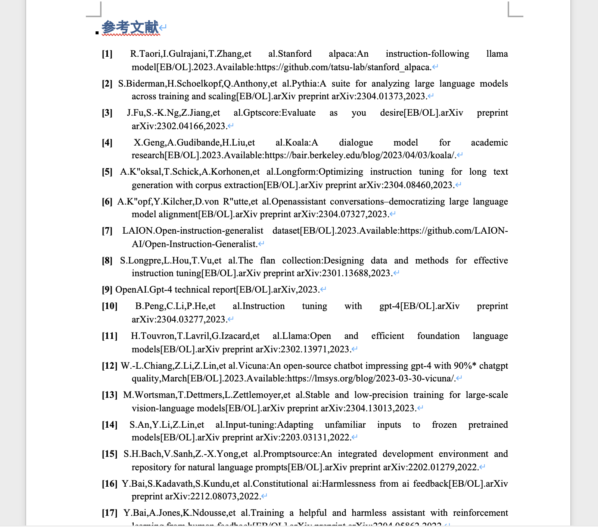
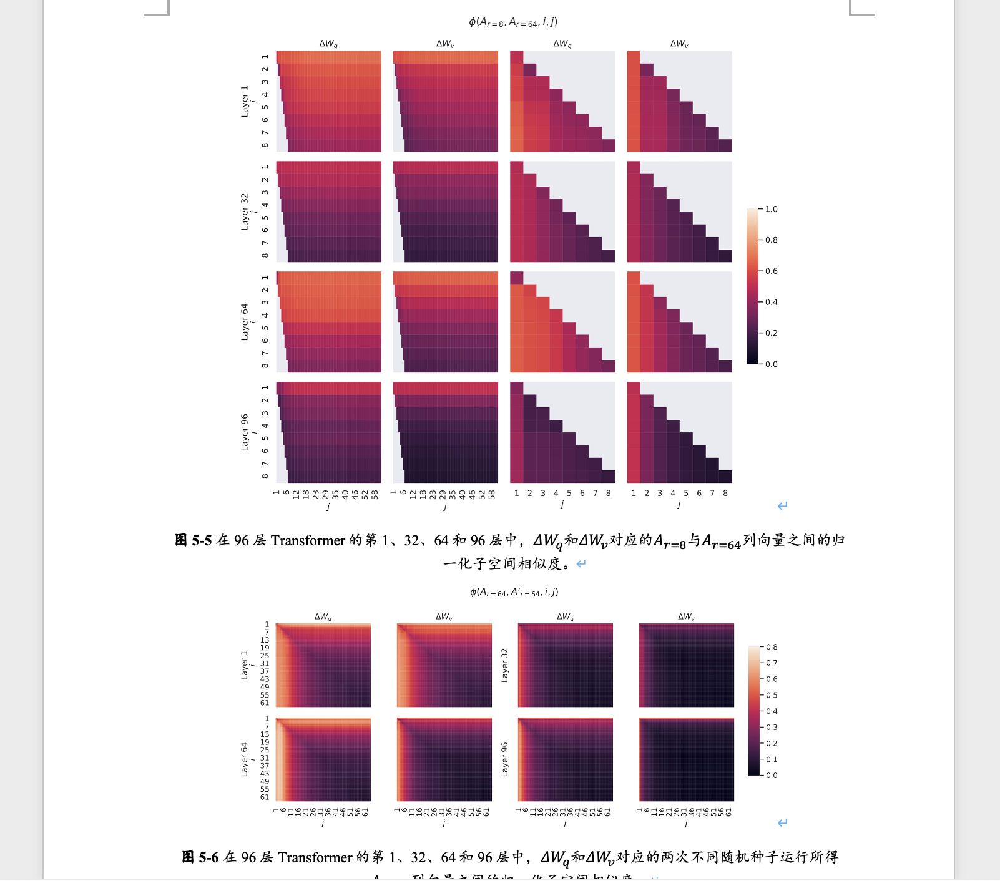
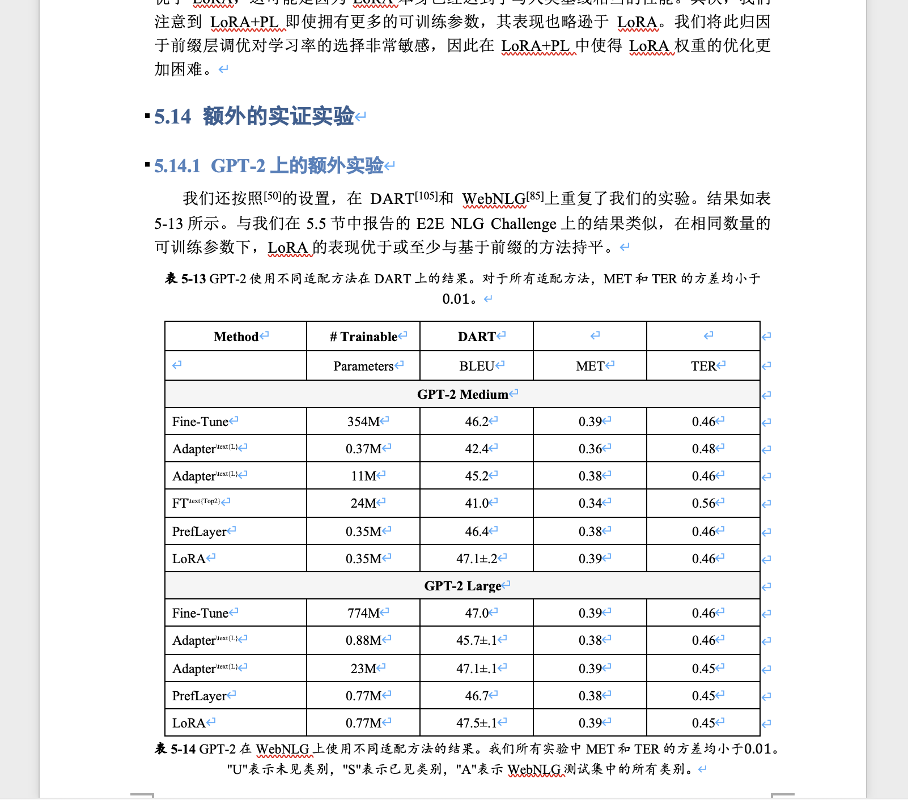
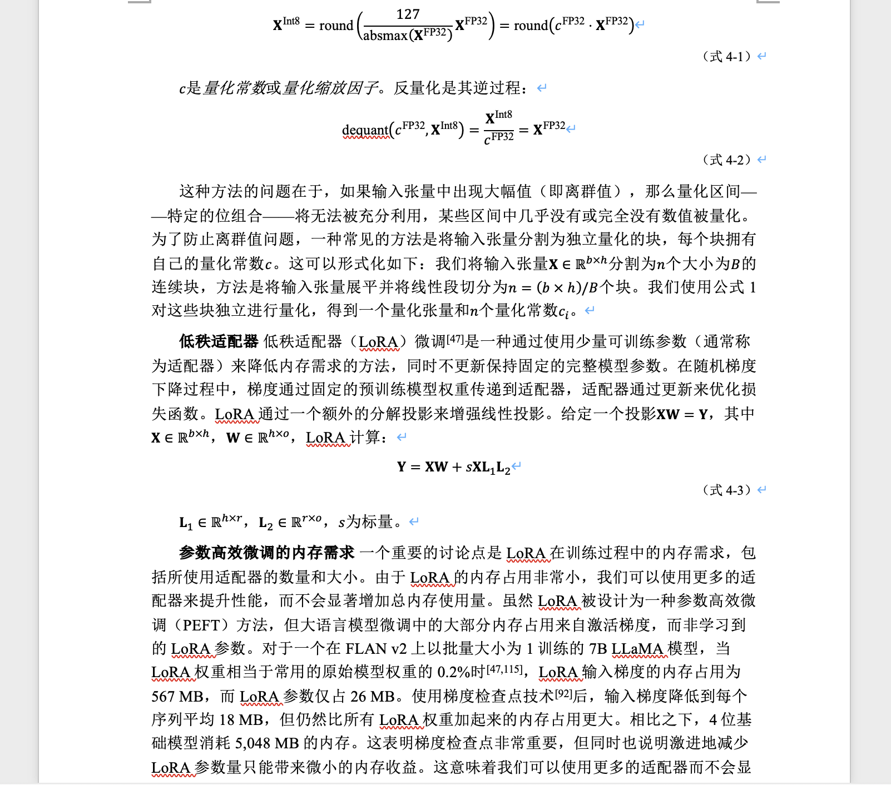

# latex2word

[English](README.md) | **中文**

将 LaTeX 论文转换为翻译好的 Word 文档——格式统一与段落级翻译一步到位。

> **翻译方向：英文 → 中文。** 当前翻译流水线专为将英文学术论文转换为中文而设计，暂不支持其他目标语言。

> **持续维护中。** 本项目正在积极开发，真实论文中发现的边缘情况是每次改进的驱动力——用的人越多，工具越健壮。非常欢迎社区参与贡献。

## 为什么选择 latex2word？

发表学术论文后，研究者常常需要提交 Word 版本——毕业论文要求、机构存档或只接受 `.docx` 的期刊编辑系统。问题在于，目前没有任何工具能同时解决这两件事：

- **pandoc** 是标准的 LaTeX 转 Word 工具，但对真实论文的兼容性很差。复杂环境（算法、自定义定理样式、中英文混排、多文件项目）经常出错或产生格式混乱的输出。
- **手动复制粘贴 PDF** 费时费力，且会丢失所有文档结构。
- **翻译工具** 处理纯文本，完全不理解 LaTeX 结构，图片、公式和交叉引用在翻译过程中全部损坏。

latex2word 专为这个工作流设计：理解 LaTeX 结构，在翻译过程中完整保留它，最后用一条命令生成格式规范的 Word 文档。

## 功能特性

<table>
  <tr>
    <td></td>
    <td></td>
  </tr>
  <tr>
    <td></td>
    <td></td>
  </tr>
</table>

<sub>基于 LoRA 和 QLoRA 开源论文转换得到的结果，参考文献已合并去重，整体格式遵循国内学术论文排版习惯。</sub>

**多文档、多章节**
单次运行可处理多篇论文。每篇论文放在一个编号子目录下，章节号自动传播到图片标签、表格标签和章节引用（`图1-1`、`2.3节`等）。

**参考文献合并与去重**
多篇论文的引用自动合并为一份参考文献列表。重复条目（相同 DOI 或标题）自动检测并合并，无需手动整理。

**段落级高并发翻译**
文本在段落粒度进行分块，并行批量发送给 LLM 提供商。并发数、批次大小和模型均可配置。断点续传支持在长文档中断后从已完成的位置继续，无需重新翻译。

**自定义翻译术语**
可指定领域专有名词术语表（如专有名词、缩写、领域特定词组），要求翻译时必须保留或以指定方式处理。术语表自动注入翻译提示词。

**丰富的元素支持**
以下 LaTeX 元素无需手动干预，直接渲染进 Word 文档：

| 元素 | 处理方式 |
|------|----------|
| 图片 | 嵌入为图像并附带图注 |
| 表格 | 转换为 Word 表格，支持合并单元格 |
| 公式 | 通过 pandoc/MathML → OMML 渲染为 Word 原生数学公式 |
| 算法 / 伪代码 | 保留为格式化代码块 |
| 脚注 | 转换为 Word 脚注 |
| 交叉引用 | 解析并重写（`\ref`、`\cite`、`\label`） |
| 定理类环境 | 附带可配置的中文显示名称 |

**多 LLM 提供商支持**
支持 Anthropic（Claude）、DeepSeek、OpenAI、Moonshot 及任何兼容 OpenAI 接口的端点，一个参数即可切换。

**全流程可配置**
每个阶段——分块策略、翻译提示词、渲染样式、字号、标签格式——均可通过 `configs/pipeline.json` 和 `configs/rules.json` 覆盖，无需修改源代码。

---

## 安装

### 第一步：克隆仓库并进入目录

```bash
git clone https://github.com/KLGR123/latex2word.git
cd latex2word
```

### 第二步：运行安装脚本（推荐）

安装脚本一键完成：创建 conda 环境、安装 Python 依赖、安装 pandoc，并生成 `secrets.env` 模板文件。

```bash
bash install.sh
```

运行完成后激活环境：

```bash
conda activate latex2word
```

**可选参数：**

```bash
bash install.sh --no-pandoc   # 跳过 pandoc 安装
bash install.sh --no-python   # 跳过 Python/conda 配置
```

如果未安装 conda，脚本会自动退回到在当前 Python 环境中安装（需要 Python 3.10+）。

### 第二步：填入 API Key

打开安装脚本生成的 `secrets.env`（如果手动安装，自己创建该文件），填入你的 API Key：

```bash
# secrets.env
OPENAI_API_KEY=sk-proj-xxxxxxxxxxxxxxxxxxxxxxxxxxxxxxxx
```

只需填入你实际使用的那个提供商的 Key 即可。例如，改用 DeepSeek：

```bash
DEEPSEEK_API_KEY=sk-xxxxxxxxxxxxxxxxxxxxxxxxxxxxxxxx
```

支持的提供商及对应的环境变量名：

| 提供商 | `--provider` 参数值 | 环境变量名 |
|--------|---------------------|-----------|
| Anthropic（Claude） | `anthropic` | `ANTHROPIC_API_KEY` |
| OpenAI | `openai` | `OPENAI_API_KEY` |
| DeepSeek | `deepseek` | `DEEPSEEK_API_KEY` |
| Moonshot（Kimi） | `kimi` | `MOONSHOT_API_KEY` |
| 任何兼容 OpenAI 接口的端点 | `openai` | `OPENAI_API_KEY` + `--base-url` 参数 |

## 输入目录结构

将每篇论文放在一个编号子目录下：

```text
inputs/
  1/
    main.tex
    references.bib
    figures/
  2/
    paper.tex
    paper.bbl
```

文件夹名称会作为章节号，用于生成标签，如 `图1-1`、`1.2节`。

## 使用方法

运行完整流水线：

```bash
python main.py --stage all
```

可编辑安装后，等价的命令行工具也可使用：

```bash
latex2word --stage all
```

单独运行某一阶段：

```bash
python main.py --stage preprocess
python main.py --stage translate
python main.py --stage postprocess
```

常用参数覆盖：

```bash
python main.py --provider deepseek --model deepseek-chat --concurrency 8
python main.py --inputs-dir inputs --outputs-dir outputs
python main.py --print-config
```

## 配置说明

流水线行为通过 `configs/pipeline.json` 配置。

`configs/pipeline.json` **不提交到仓库**——它是你的本地配置文件，已被 gitignore，修改内容不会出现在 PR 中。

`configs/pipeline.json.example` 提交到仓库，作为规范参考。它同时也是 fallback：如果你还没有创建 `pipeline.json`，工具会直接读取 example，开箱即用。

**首次使用**（`install.sh` 会自动完成）：

```bash
cp configs/pipeline.json.example configs/pipeline.json
# 然后编辑 pipeline.json，设置你的提供商、模型和其他偏好
```

主要配置区块：

| 区块 | 控制内容 |
|------|----------|
| `paths` | 输入/输出/配置目录路径 |
| `preprocess` | TeX 内联、参考文献解析、分块 |
| `translate` | 模型提供商、并发数、术语表、断点续传 |
| `postprocess` | 引用替换、DOCX 渲染 |

规则类配置位于 `configs/rules.json`，目前可配置的规则包括：

- `preprocess.chunk_block_envs` — 作为整块保留的 LaTeX 环境
- `translation.prompts` — 系统提示词、术语表提示词、批量响应提示词
- `translation.syntax.extra_patterns` — 翻译过程中必须保持不变的额外正则表达式
- `translation.section_title_cache` — 缓存的章节标题翻译，避免重复 API 调用
- `translation.skip_envs` — 不进行翻译的 LaTeX 环境
- `postprocess.label_env_categories` — 环境到标签的映射（图/表/公式/代码）
- `rendering.fonts`、`rendering.sizes`、`rendering.colors` — DOCX 样式默认值
- `rendering.math_env_labels` — 定理类环境的中文显示名称
- `rendering.envs` — DOCX 渲染器分类器使用的额外 LaTeX 环境

规则会与内置默认值合并，只需指定需要覆盖的部分即可。

## 输出文件

```text
outputs/
  chunks.json
  citations.json
  translated.json
  labeled.json
  refmap.json
  replaced.json
  final.docx
```

默认保留中间 JSON 文件，方便从任意阶段断点续跑。如需清理，可传入 `--cleanup-translated` / `--cleanup-chunks` 等参数，或在 `configs/pipeline.json` 中开启对应选项。

## 包结构

```text
latex2word/
  preprocessing/    TeX 内联、宏展开、格式处理、参考文献解析、分块
  translation/      LLM 提供商、批量请求、语法保护、章节缓存
  postprocessing/   段落标记、引用映射构建、交叉引用替换
  rendering/        DOCX 渲染 — 图片、公式、表格、脚注
```

## 参与贡献

欢迎提交 Bug 报告与修复，尤其是在真实 LaTeX 论文中发现的渲染边缘情况。用这个工具跑过的论文越多，工具就越健壮。

请参阅 [CONTRIBUTING_CN.md](CONTRIBUTING_CN.md) 了解 PR 流程规范。

## 加入我们

扫描下方二维码加入微信交流群，与社区成员一起讨论、反馈问题、分享使用经验。

<p align="center">
  
</p>

如果二维码已过期，请开一个 Issue，我们会及时更新。
